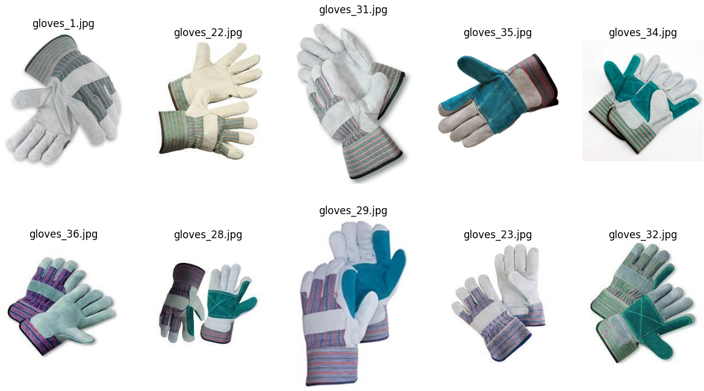
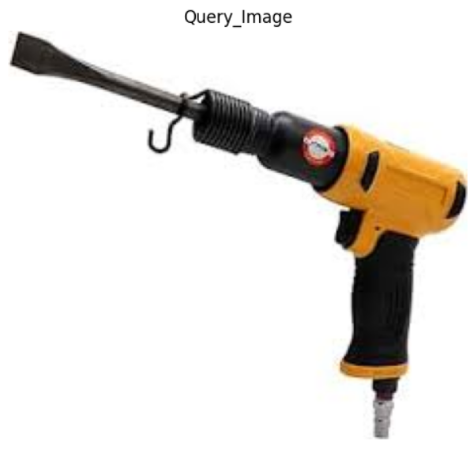
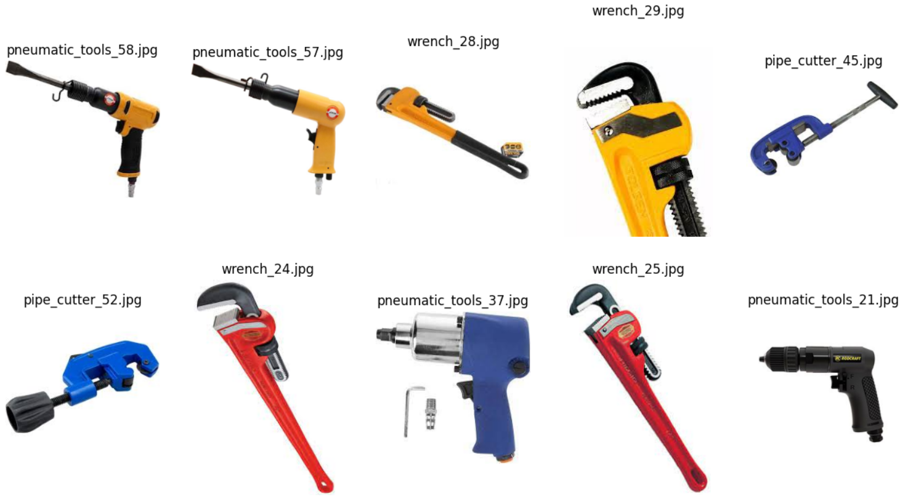
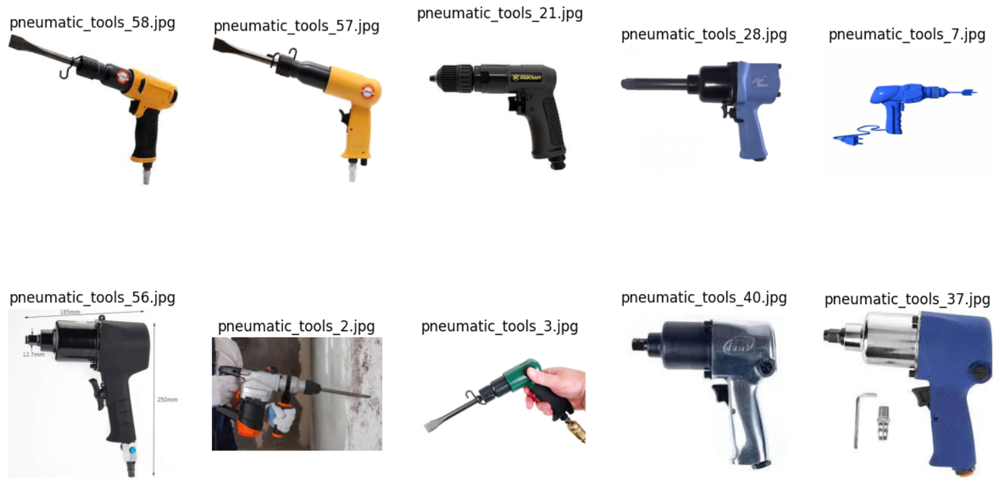

# Image-To-Image-Search

## Input Image
The input image is an RGB image of a product


## Output
The output image displays the top 10 most similar product images with respect to the input image.


## Inference Before Fine-tuning
In the pre-finetuning stage, the CLIP model exhibits inconsistencies in searching for similar images. For example, when searching for the top 10 similar images from an image of the 'Pneumatic Tool' class, it identifies wrenches and pipe cutters alongside pneumatic tools.
 



## Inference After Fine-tuning
The model performs better after fine-tuning.


## Installation

Creating a Python Environment using the following Command. Replace ENV_NAME with the name you want to give to your virtual environment.

```
python3 -m venv ENV_NAME
```


Next, activate the virtual environment by running:

```
source ENV_NAME/bin/activate
```

To install the required dependencies, run the following commands:

```
pip3 -qqq install transformers torch datasets
pip3 -qqq install gdcm
pip3 -qqq install pydicom
pip -qqq install faiss-gpu
pip -qqq install pinecone-client
```
